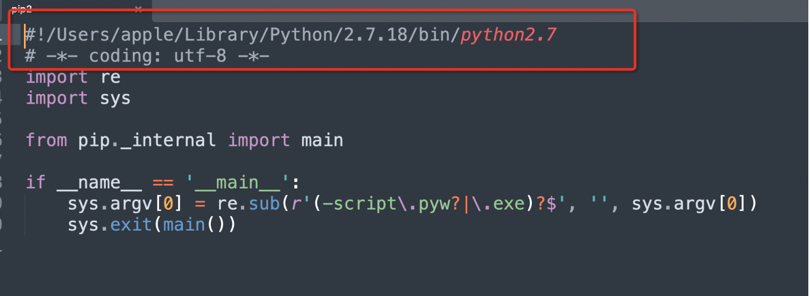
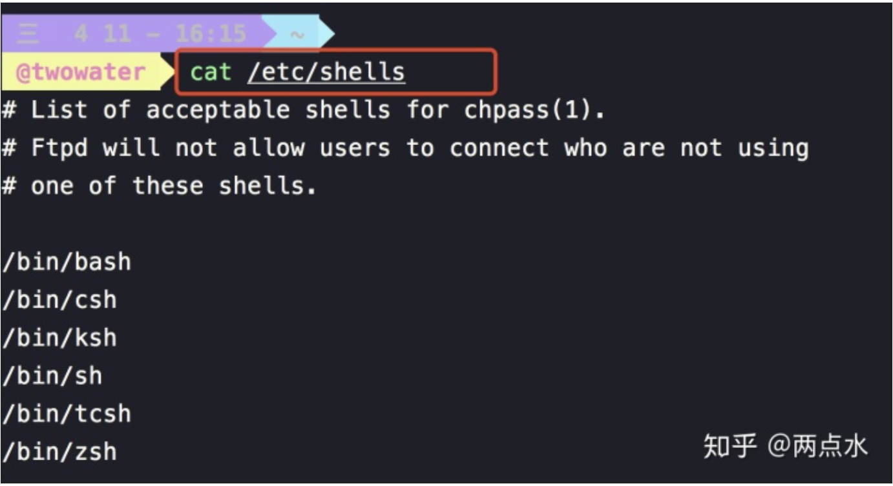
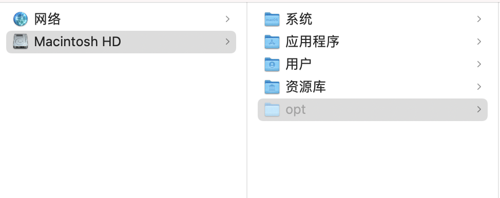
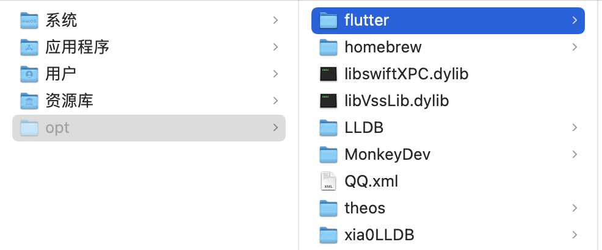

[toc]

# 常用的 Mac 开发环境

### Homebrew 安装

官网地址:https://brew.sh/

```shell
/bin/zsh -c "$(curl -fsSL https://gitee.com/cunkai/HomebrewCN/raw/master/Homebrew.sh)"
```

一键安装：

```shell
安装指令：
/bin/zsh -c "$(curl -fsSL https://gitee.com/cunkai/HomebrewCN/raw/master/Homebrew.sh)"

卸载指令（如果需要）：
/bin/zsh -c "$(curl -fsSL https://gitee.com/cunkai/HomebrewCN/raw/master/HomebrewUninstall.sh)"

升级版本
brew update

查看版本
brew -v
```

国内安装地址：

```shell
/bin/bash -c "$(curl -fsSL https://gitee.com/ineo6/homebrew-install/raw/master/install.sh)"
```

安装慢可以设置镜像源 （中科大）:

```shell
git -C "$(brew --repo)" remote set-url origin https://mirrors.ustc.edu.cn/brew.git

git -C "$(brew --repo homebrew/core)" remote set-url origin https://mirrors.ustc.edu.cn/homebrew-core.git

git -C "$(brew --repo homebrew/cask)" remote set-url origin https://mirrors.ustc.edu.cn/homebrew-cask.git

brew update
```

### Python 安装

官网地址:https://www.python.org/

#### 使用 Xcode 自带的

环境变量配置：这里使用的 python 为 Xcode 自带的

```shell
export PATH=/Users/apple/Library/Python/3.8/bin:$PATH

如果需要python2的话
export PATH=/Users/apple/Library/Python/2.7.18/bin:$PATH
```

下载 Python2.7.18

```shell
brew install pyenv
pyenv install 2.7.18
open ~/.pyenv/version
```

知道 2.7.18 版本放到 `/Users/apple/Library/Python/`这里去

编辑 pip2

```shell
vim pip2
```



#### Homebrew 安装

- 安装命令

```shell
brew install python3
```

- 导出环境变量

```shell
export PATH="$(brew --prefix python@3.11)/libexec/bin:$PATH"
```

#### Pip 安装

官网地址：https://pip.pypa.io/en/stable/installing/#installing-with-get-pip-py

用哪个版本的 Python 运行安装脚本，pip 就被关联到哪个版本，如果是 Python3 则执行以下命令

```shell
sudo python2 get-pip.py
或
sudo python3 get-pip.py
```

### Nodejs 安装

官网地址:http://nodejs.cn/download/

#### 安装包安装

配置环境变量：

```shell
PATH=$PATH:/usr/local/bin/
```

#### 二进制库安装

```shell
brew install nodejs
brew install npm
```

#### 验证

```shell
npm -v
node -v
```

#### 修改 npm 的源

```shell
npm install -g cnpm --registry=https://registry.npm.taobao.org
cnpm install [name]
```

### iTerm2 安装

官网地址:http://iterm2.com/downloads.html

博客:https://zhuanlan.zhihu.com/p/550022490

### oh-my-zsh 安装

oh-my-zsh 的官网地址：https://ohmyz.sh/

```shell
sh -c "$(curl -fsSL https://raw.github.com/ohmyzsh/ohmyzsh/master/tools/install.sh)"
```

#### 修改默认的 shell

安装完成之后，在 `/bin` 目录下会多出一个 `zsh` 的文件。

你可以通过以下命令来查看：

```shell
cat /etc/shells
```

注意，`cat` 后面是有个空格的。



其次，macOS 在 Catalina 版本之前都是使用 `dash` 作为终端，

如果你想修改为 `zsh` ，可以使用以下命令：

```text
chsh -s /bin/zsh
```

当然，你后悔了，想改回原来的 `dash` ，同样使用上面的 `chsh` 命令就可以。

```text
chsh -s /bin/bash
```

#### 修改主题

主题目录：`~/.oh-my-zsh/themes`

Github 地址：https://github.com/ohmyzsh/ohmyzsh/wiki/themes

```text
vim ~/.zshrc
```

```shell
ZSH_THEME="spaceship"
```

**powerlevel9k**主题安装

- 用 powerlevel9k 为例，通过 `git clone` 下载到 oh-my-zsh 放置第三方主题的目录中
- ```text
  git clone https://github.com/bhilburn/powerlevel9k.git ~/.oh-my-zsh/custom/themes/powerlevel9k
  ```
- 修改 `ZSH_THEME="spaceship"`为 `ZSH_THEME="powerlevel9k"`
- ```text
  source ~/.zshrc
  ```

**安装 powerline 和 PowerFonts**

官网地址：https://powerline.readthedocs.io/en/latest/installation.html

```shell
pip install powerline-status
```

当然安装之前要确保你已经安装了 python 环境和 pip , python 环境一般 Mac 系统都会自带的，所以如果你在安装过程中遇到：

```text
zsh: command not found: pip
```

你也可以通过命令来安装

```text
sudo easy_install pip
```

PowerFonts 是一个字体库，要安装字体库需要先把 `git clone` 到本地，然后执行源码中的 `install.sh`

具体的流程如下：

```text
# git clone
git clone https://github.com/powerline/fonts.git --depth=1
# install
cd fonts
./install.sh
# clean-up a bit
cd ..
rm -rf fonts
```

**powerlevel10k**主题安装

- 安装

```shell
git clone --depth=1 https://github.com/romkatv/powerlevel10k.git ${ZSH_CUSTOM:-$HOME/.oh-my-zsh/custom}/themes/powerlevel10k
```

- 编辑 .zshrc 文件， 文件路径 ~/.zshrc

```shell
open ~/.zshrc

ZSH_THEME="powerlevel10k/powerlevel10k"
```

**.zshrc**设置

- 下载 Dream_01.zshrc 或 Dream_02.zshrc
- 找到 .zshrc 文件将 Dream_01.zshrc 或 Dream_02.zshrc 中代码复制到 zshrc 最下面
- 文件目录 :

```bash
open ~/.zshrc
```

- 安装 Hack Nerd 字体库
- iTerm -> Preferences -> Profiles -> Text -> font -> 修改成 Hack Nerd Font

#### 插件

```shell
plugins=(
  git
  zsh-syntax-highlighting
  zsh-autosuggestions
  history
  z
)
```

**zsh-syntax-highlighting 安装**

- ```shell
  cd ~/.oh-my-zsh/custom/plugins/
  git clone https://github.com/zsh-users/zsh-syntax-highlighting.git
  ```
- 然后在文件末尾添加：
- ```shell
  source ~/.oh-my-zsh/custom/plugins/zsh-syntax-highlighting/zsh-syntax-highlighting.zsh
  # source /usr/local/share/zsh-syntax-highlighting/zsh-syntax-highlighting.zsh # 如果使用命令 brew 安装，则是添加这条命令语句
  ```
- ```shell
  source ~/.zshrc
  ```

**zsh-autosuggestions 安装**

- ```shell
  cd ~/.oh-my-zsh/custom/plugins/
  git clone https://github.com/zsh-users/zsh-autosuggestions
  ```

### Cocoapods 安装

#### 安装 rvm

- 安装 mpapis 公钥。但是，正如安装页面所记录的，您可能需要 gpg。Mac OS X 不附带 gpg，因此在安装公钥之前，您需要安装 gpg。

  ```shell
  brew install gnupg
  ```

- 安装 mpapis 公钥

  ```shell
  gpg --keyserver hkp://pgp.mit.edu --recv-keys 409B6B1796C275462A1703113804BB82D39DC0E3 7D2BAF1CF37B13E2069D6956105BD0E739499BDB
  ```

  如果显示从公钥服务器接收失败则尝试下面的

  ```shell
   gpg --keyserver hkp://keys.gnupg.net --recv-keys 409B6B1796C275462A1703113804BB82D39DC0E3
  ```

- 安装 rvm

  ```shell
  \curl -sSL https://get.rvm.io | bash -s stable --ruby
  ```

- 常用命令

  ```shell
  ——查看rvm版本：rvm -v
  ——查看现在使用RVM管理的Ruby版本：which rvm
  ——列出可供RVM使用的Ruby版本：rvm list
  ——列出可安装的版本：rvm list known
  ```

- 查看一下 Ruby 的版本

  ```
  rvm list known
  ```

- 可以看到当前的最新版本，然后通过以下命令来安装它：

  ```shell
  rvm install 2.4
  ```

  安装好后将它设为默认版本：

  ```shell
  rvm use 2.4 --default
  ```

#### 更换源

```shell
sudo gem update --system
```

```shell
///这一步建议是先执行后续用到了再添加
///例如，你使用Fastlane进行自动化部署这个是需要的
gem sources --remove https://rubygems.org/
```

```shell
gem sources --add https://gems.ruby-china.com/
```

#### 验证

```shell
gem sources -l

*** CURRENT SOURCES ***
https://gems.ruby-china.com/
```

#### 安装

```bash
sudo gem install -n /usr/local/bin cocoapods
```

如果安装了多个 Xcode 使用下面的命令选择（一般需要选择最近的 Xcode 版本）

```csharp
sudo xcode-select -switch /Applications/Xcode.app/Contents/Developer
```

#### 安装本地库

方式一(官方镜像)

```shell
git clone https://github.com/CocoaPods/Specs.git ~/.cocoapods/repos/trunk
```

方式二(清华镜像)

```shell
git clone https://mirrors.tuna.tsinghua.edu.cn/git/CocoaPods/Specs.git  ~/.cocoapods/repos/trunk
```

#### 验证

```shell
pod search AFNetworking
```

### Flutter 安装

#### 创建 `opt`文件夹



下载安装包https://flutter.cn/docs/get-started/install/macos

#### 解压到 `opt`文件夹目录下



#### 配置环境变量

```shell
# Path to flutter
export PATH="$PATH:/opt/flutter/bin"
export PUB_HOSTED_URL=https://pub.flutter-io.cn
export FLUTTER_STORAGE_BASE_URL=https://storage.flutter-io.cn
```

### Java 安装

官网地址：https://www.oracle.com/java/technologies/downloads

#### 安装

选择相应的安装包一路点击下一步就可以

#### 查看安装路径

```shell
➜ /usr/libexec/java_home
/Library/Java/JavaVirtualMachines/jdk-17.0.1.jdk/Contents/Home
```

#### 配置环境变量

```shell
export JAVA_HOME=/Library/Java/JavaVirtualMachines/jdk-15.0.1.jdk/Contents/Home
export PATH=$JAVA_HOME/bin:$PATH

或者

JAVA_HOME=/Library/Java/JavaVirtualMachines/jdk1.8.0_301.jdk/Contents/Home
PATH=$JAVA_HOME/bin:$PATH:.
CLASSPATH=$JAVA_HOME/lib/tools.jar:$JAVA_HOME/lib/dt.jar:.
export JAVA_HOME
export PATH
export CLASSPATH
```

#### 验证

```shell
java -version
```

### MonkeyDev 安装

#### 安装 theos

- 下载

  ```shell
  sudo git clone --recursive https://github.com/theos/theos.git /opt/theos
  ```

- 配置环境变量

  ```shell
  export THEOS=/opt/theos
  export PATH=$PATH:$THEOS/bin
  ```

#### 安装 ldid

```shell
brew install ldid
```

#### 安装 MonkeyDev

- 安装

```shell
cd /opt
git clone https://github.com/AloneMonkey/MonkeyDev
```

```shell
cd /opt/MonkeyDev/bin
./md-install 进行安装
```

- 编译报错

file not found: /usr/lib/libstdc++.dylib

https://github.com/devdawei/libstdc-

### LLDB 调试工具库

#### 下载

```shell
cd /opt
git clone https://github.com/4ch12dy/xia0LLDB
git clone https://github.com/DerekSelander/LLDB
```

#### 配置

```shell
vi ~/.lldbinit
command script import /opt/homebrew/Cellar/chisel/2.0.1/libexec/fbchisellldb.py
command script import /opt/LLDB/lldb_commands/dslldb.py
command script import /opt/xia0LLDB/src/xlldb.py
command alias freshxlldb command script import /opt/xia0LLDB/src/xlldb.py
```

### 下载 Xcode 的工具

https://xcdownloader.com/
https://github.com/RobotsAndPencils/XcodesApp/

CodeSnippet

```powershell
~/Library/Developer/Xcode/UserData/CodeSnippet
```

### 配置 Sublime 的终端命令行工具

```shell
ln -s /Applications/Sublime\ Text.app/Contents/SharedSupport/bin/subl  /usr/local/bin/sublime
```

### 必装软件

- Alfred
- Android Studio
- App Cleaner & Uninstaller
- Beyond Compare
- GitHub Desktop
- Hopper Disassembler
- LocalizationEditor（https://github.com/igorkulman/iOSLocalizationEditor）
- LX Music（https://github.com/lyswhut/lx-music-desktop）
- MachOView（https://github.com/fangshufeng/MachOView）
- Microsoft Edge
- OneDrive
- Pasta
- Snipaste
- Sublime Text
- SwitchHosts!
- Typora（主题：https://github.com/liangjingkanji/DrakeTyporaTheme）
- Visual Studio Code
- ZY Player（https://github.com/Hunlongyu/ZY-Player）
- XMind
